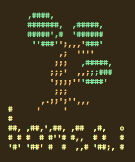

#  Install

#### Preface

This is a quick and dirty guide.  
Expect this to be fleshed out over many pages 
with lengthy explanations in the actual handbook.

----

1. **clone**

```sh
git clone http://github.com/bonsai-linux/bonsai
cd bonsai
```

2. **build and install**

```sh
make
make PREFIX=$path install
```

The above will compile all the scripts into one executable, then strip it of 
comments/blank lines.

`"$PREFIX"` here is wherever you would like your chroot to be located.  
If you are planning to install to hardware, then this will be where your drive is mounted.

Omitting `PREFIX=` will install to the (default) directory of `./build`.

3. **bootstrap**

```sh
root=$path ./bonsai --bootstrap
```

This will create dirs, assign permissions, and install the base system.

Here you should use whichever `$PREFIX` you used with make install.  

----

**Note:** This has to be an absolute path, so if using the default of `./build` 
you would then need to use `root="$PWD"/build`

4. **relink**

```sh
root=$path ./bonsai --relink-world --chroot
```

This relinks all package symlinks to `/src/pkgs` instead of `$PREFIX/src/pkgs`.

It is necessary as if you had not, when you chroot in all the symlinks will be broken
as they do not point to files on the correct root.

5. **chroot**

You have two options: 1. do this manually or 2. use the `chroot.sh` tool from the [tools](http://github.com/bonsai-linux/tools) repo.

The tools script comes highly recommended, however if you wish do so manually:

```sh
mount -o bind -t devtmpfs /dev     $chroot/dev
mount -o bind -t proc     /proc    $chroot/proc
mount -o bind -t sysfs    /sys     $chroot/sys
chroot $path /bin/sh
```

6. **exit**

Exit the chroot. If you used the `chroot.sh` script, drives will be unmounted automatically.

----

If the above all completed successfully, **congratulations**!  
You have just installed your `bonsai` chroot!


